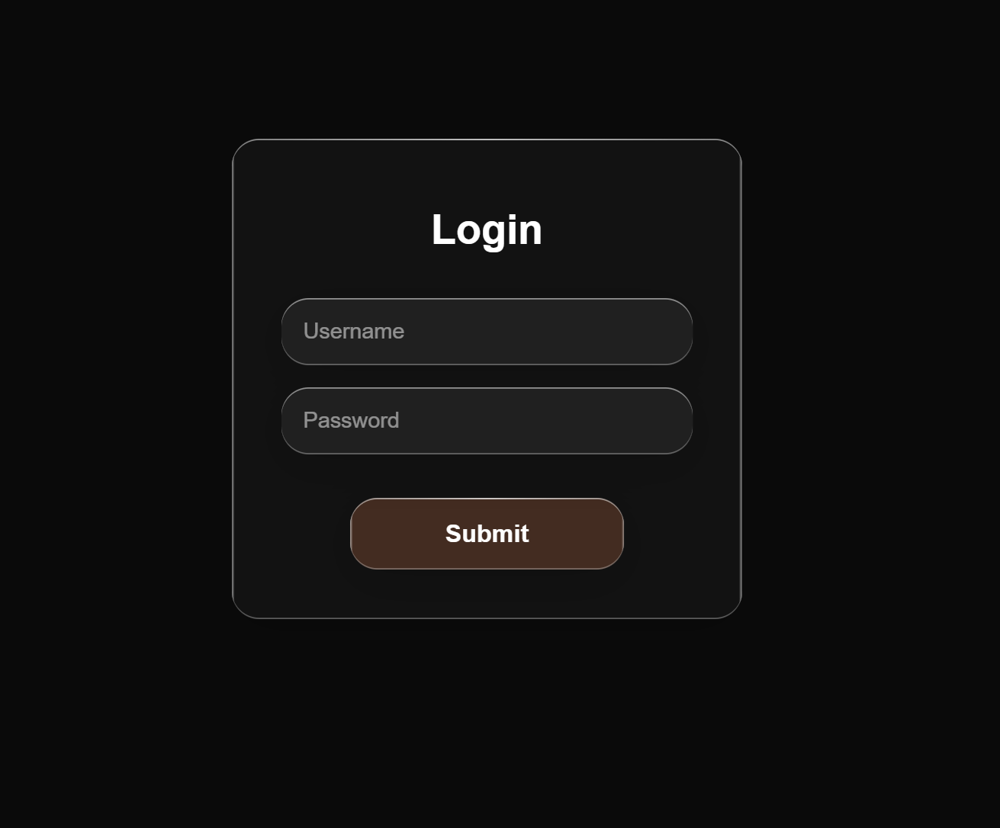
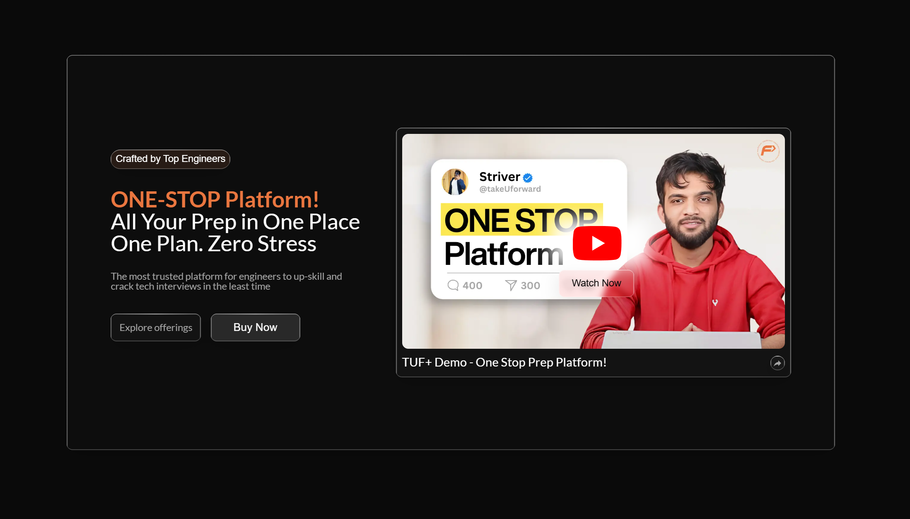

# TUF Liquid Glass Design

## Screenshots

### Login Page


### Hero Section


## Overview

A modern Next.js application featuring authentic Apple-inspired liquid glass effects. This project demonstrates advanced CSS techniques including backdrop filters, gradient borders, and sophisticated masking to create realistic glass materials.

## Features

✨ **Liquid Glass Effect**
- Authentic Apple-style glass morphism
- Dynamic edge refraction lighting
- Corner masking for realistic light behavior
- Backdrop blur and saturation effects

🎨 **Design Elements**
- Responsive glass cards
- Gradient borders without masking
- Two-class CSS system for universal application
- Multiple glass effect variants

📱 **Pages**
- Login page with glass input fields
- Hero section with video thumbnail
- Interactive glass buttons and components

## Tech Stack

- **Framework**: Next.js 15.5.4
- **Styling**: Tailwind CSS v4
- **Font**: Lato, Geist Sans, Geist Mono
- **Icons**: Custom SVG icons
- **Images**: Next.js Image optimization

## Glass Effect Implementation

The liquid glass effect is implemented using a two-class system:

### `.glass-card`
- Base glass material properties
- Backdrop blur and transparency
- Edge lighting with gradients
- Corner masking for authentic refraction

### `.liquidGlass-wrapper` & `.liquidGlass-surface`
- Advanced Apple-style refraction
- Hover interactions
- Multiple edge configurations
- SVG filter distortions

## Key CSS Features

- **Dynamic Borders**: Gradient-based borders that adapt to content
- **No Masking**: Pure CSS gradients instead of clip-path masking
- **Universal Classes**: Maximum of two CSS classes for any component
- **Edge-Specific Refraction**: Light appears only on top and left edges (Apple-style)

## Project Structure

```
src/
├── app/
│   ├── globals.css          # Glass effect styles
│   ├── layout.js           # Root layout
│   ├── page.js             # Home page
│   ├── login/
│   │   └── page.js         # Login page with glass forms
│   ├── heropg/
│   │   └── page.js         # Hero section with video thumbnail
│   └── glass-effect/
│       └── page.js         # Glass effect demo
├── components/
│   └── ui/
│       └── button.jsx      # Glass button component
└── public/
    ├── logos_youtube-icon.svg
    ├── mdi_share.svg
    └── yt_thumbnail.png
```

## Installation

1. **Clone the repository**
   ```bash
   git clone https://github.com/shubhambhattog/tuf-liquid-design.git
   cd tuf-liquid-design
   ```

2. **Install dependencies**
   ```bash
   npm install
   ```

3. **Run development server**
   ```bash
   npm run dev
   ```

4. **Open in browser**
   ```
   http://localhost:3000
   ```

## Usage

### Basic Glass Card
```jsx
<div className="glass-card w-[372px] h-[350px] rounded-[24px]">
  Your content here
</div>
```

### Advanced Liquid Glass
```jsx
<div className="liquidGlass-wrapper liquidGlass-surface">
  <div className="liquidGlass-effect"></div>
  <div className="liquidGlass-tint"></div>
  <div className="liquidGlass-shine"></div>
  <div className="liquidGlass-text">
    Your content here
  </div>
</div>
```

## Glass Effect Variants

- **Default**: Top-left edge refraction (Apple style)
- **Top-Right**: Right edge highlighting
- **Bottom-Left**: Lower edge refraction
- **All-Edges**: Uniform edge lighting

## Browser Support

- ✅ Chrome/Edge (full support)
- ✅ Safari (webkit prefixes included)
- ✅ Firefox (modern versions)
- ⚠️ IE11 (limited support)

## Performance Considerations

- Uses `transform: translateZ(0)` for GPU acceleration
- `will-change: transform` for hover animations
- Optimized backdrop-filter blur values
- Minimal DOM impact with pseudo-elements

## Contributing

1. Fork the repository
2. Create your feature branch (`git checkout -b feature/amazing-glass`)
3. Commit your changes (`git commit -m 'Add amazing glass effect'`)
4. Push to the branch (`git push origin feature/amazing-glass`)
5. Open a Pull Request

## Design Credits

Inspired by Apple's design language and modern glass morphism trends. Special attention to authentic light refraction behavior and edge-specific highlighting.

## License

This project is licensed under the MIT License - see the [LICENSE](LICENSE) file for details.

## Acknowledgments

- Apple Design Team for glass design inspiration
- Tailwind CSS team for the utility-first framework
- Next.js team for the React framework
- Community feedback and testing

---

**Built with ❤️ by [Shubham Bhatt](https://github.com/shubhambhattog)**

## Getting Started

First, run the development server:

```bash
npm run dev
# or
yarn dev
# or
pnpm dev
# or
bun dev
```

Open [http://localhost:3000](http://localhost:3000) with your browser to see the result.

You can start editing the page by modifying `app/page.js`. The page auto-updates as you edit the file.

This project uses [`next/font`](https://nextjs.org/docs/app/building-your-application/optimizing/fonts) to automatically optimize and load [Geist](https://vercel.com/font), a new font family for Vercel.

## Learn More

To learn more about Next.js, take a look at the following resources:

- [Next.js Documentation](https://nextjs.org/docs) - learn about Next.js features and API.
- [Learn Next.js](https://nextjs.org/learn) - an interactive Next.js tutorial.

You can check out [the Next.js GitHub repository](https://github.com/vercel/next.js) - your feedback and contributions are welcome!

## Deploy on Vercel

The easiest way to deploy your Next.js app is to use the [Vercel Platform](https://vercel.com/new?utm_medium=default-template&filter=next.js&utm_source=create-next-app&utm_campaign=create-next-app-readme) from the creators of Next.js.

Check out our [Next.js deployment documentation](https://nextjs.org/docs/app/building-your-application/deploying) for more details.
